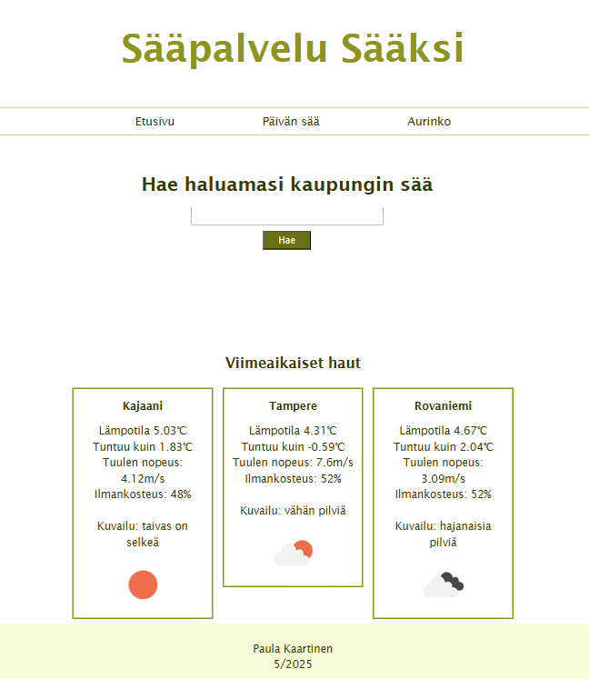
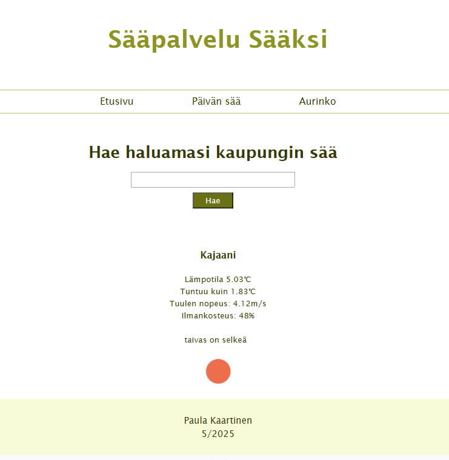

# weatherProject
The aim of this project was to create a weather website using HTML, CSS and JavaScript. The project is a part of studies at Oulu University of Applied Sciences.

---

## The weather website
The main idea is to provide current weather data to the user. The homepage contains of three modules: a search box, searched weather data and three recent searches. There is also a "Daily weather" page which offers weather data from 11 different cities from Finland. The third page in the navigation, is for sunrise and sunset times.

* HTML - the structure of the website 
* CSS - styles of the website
* JavaScrpit - implements the functionality

---
## Usage instructions
1. API key
- This project utilizes [OpenWeather](https://openweathermap.org/city/2643743). You need the OpenWeather account to get an API key.

2. Download 
- Download the project and fill the API key (const API_KEY = '') in each JavaScript file's API key to yours.

3. Live server
- Live Server is an extension to Visual Studio Code that makes it easy to run the website locally.

---
## Design

---
### Contributor
Paula Kaartinen